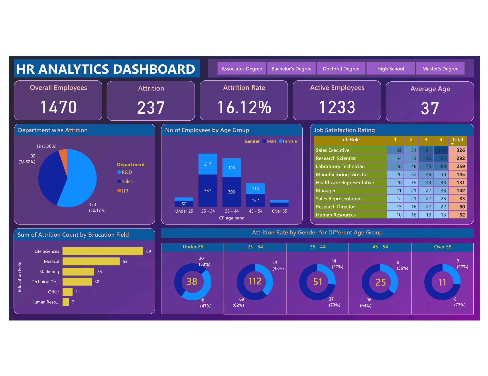

# 👥 HR Analytics Dashboard — Employee Attrition & Workforce Intelligence

> A Microsoft Power BI dashboard built to help HR teams and business leaders understand **why employees leave**, **who is at risk**, and **where to intervene** — transforming raw HR data into actionable workforce strategy.


---

## 📌 Table of Contents

- [Business Problem](#-business-problem--objective)
- [Dashboard Preview](#-dashboard-preview)
- [Dataset Description](#-dataset-description)
- [Key Insights](#-key-insights)
- [Tools & Technologies](#️-tools--technologies)
- [DAX Measures](#-dax-measures--calculations)
- [Dashboard Features](#-dashboard-features)
- [How to Use](#-how-to-use)
- [Author](#-author)

---

## 🎯 Business Problem & Objective

Employee attrition is one of the most expensive and disruptive challenges organizations face. Replacing a single employee can cost **50–200% of their annual salary** when factoring in recruitment, onboarding, and lost productivity.

This dashboard was built to answer the following critical HR questions:

| Business Question | Dashboard Answer |
|---|---|
| How many employees have left and what is our attrition rate? | KPI Cards — 237 attritions, 16.12% rate |
| Which department is bleeding talent the most? | Department-wise Attrition Pie Chart |
| Are younger employees leaving faster than senior ones? | Attrition Rate by Age Group (Donut Charts) |
| Does education background influence attrition? | Education Field Attrition Bar Chart |
| How satisfied are employees across different job roles? | Job Satisfaction Rating Matrix |
| Is there a gender gap in attrition across age groups? | Gender-segmented Attrition Analysis |

**Objective:** Equip HR departments and people managers with a data-driven tool to proactively identify attrition risk, optimize retention strategies, and improve workforce planning.

---

## 📊 Dashboard Preview



> **Dashboard Highlights at a Glance:**
> - Overall Employees: **1,470** | Active: **1,233** | Attrition: **237**
> - Attrition Rate: **16.12%** | Average Employee Age: **37**
> - Filterable by Education Level: Associate, Bachelor's, Doctoral, High School, Master's

---

## 🗂️ Dataset Description

The dataset contains **1,470 employee records** with 35+ attributes covering demographics, job characteristics, compensation, satisfaction scores, and employment history.

| Column | Description | Type |
|---|---|---|
| `EmployeeID` | Unique identifier per employee | Categorical |
| `Age` | Employee age | Numeric |
| `Department` | R&D, Sales, HR | Categorical |
| `JobRole` | Specific role title (9 roles) | Categorical |
| `Attrition` | Whether employee left (Yes/No) | Boolean |
| `Gender` | Male / Female | Categorical |
| `Education` | Education level (1–5) | Ordinal |
| `EducationField` | Field of study | Categorical |
| `JobSatisfaction` | Rating 1–4 (Low to Very High) | Ordinal |
| `MonthlyIncome` | Salary in USD | Numeric |
| `YearsAtCompany` | Tenure in years | Numeric |
| `WorkLifeBalance` | Rating 1–4 | Ordinal |
| `PerformanceRating` | 1–4 scale | Ordinal |
| `OverTime` | Whether employee works overtime | Boolean |

**Data Source:** IBM HR Analytics Employee Attrition & Performance dataset (Excel format)  
**Total Records:** 1,470 rows | **Attrition Cases:** 237

---

## 💡 Key Insights

These insights were derived directly from the dashboard and are framed as business-ready findings:

### 🔴 Attrition Risk Insights

1. **R&D Department carries the highest attrition volume** — 133 employees (56.12% of all attrition), suggesting potential issues with role complexity, growth opportunities, or compensation in technical roles.

2. **Employees aged 25–34 are the most at-risk cohort** — 112 out of 237 total attritions fall in this age band, with males (62%) leaving at a higher rate than females (38%). This is the prime career-switching window and should be a priority for retention programs.

3. **Life Sciences and Medical education fields drive the most attrition** — 89 and 63 employees respectively, indicating that highly specialized talent may be finding better opportunities elsewhere or feeling underutilized.

### 🟡 Satisfaction & Engagement Insights

4. **Sales Executives show the largest headcount (326 total)** but satisfaction scores reveal 69 employees rated their job satisfaction at Level 1 (lowest) — the highest dissatisfaction count of any role, signaling a need for targeted engagement or compensation review.

5. **Over-55 employees show disproportionately low attrition (11 total, 27% rate)** — indicating that experienced senior staff are highly stable, but attrition is still occurring, which warrants succession planning.

6. **The 45–54 age group has a 36% attrition rate** (9 out of 25 cases are female) — a potential mid-career signal that may benefit from mentoring programs or flexible work arrangements.

### 🟢 Workforce Composition Insights

7. **Active workforce skews toward the 35–44 band** with 309 male and 196 female employees — the most tenured and productive segment. Retaining this cohort should be a strategic priority.

8. **HR Department contributes only 5.06% of attrition (12 employees)** — suggesting the people management function itself has strong internal culture or satisfaction levels.

---

## 🛠️ Tools & Technologies

| Tool | Purpose |
|---|---|
| **Microsoft Power BI Desktop** | Dashboard design, data modeling, interactive visualizations |
| **Microsoft Excel** | Raw data storage, initial data review |
| **Power Query (M Language)** | Data cleaning, transformation, and shaping |
| **DAX (Data Analysis Expressions)** | Custom KPI measures and calculated columns |
| **Power BI Service** *(optional)* | Cloud publishing and sharing |

---

## 🧮 DAX Measures & Calculations

All custom measures were written in DAX to ensure accurate, dynamic calculations across all filter contexts.

```DAX
-- ─────────────────────────────────────────
-- 1. Total Attrition Count
-- ─────────────────────────────────────────
Attrition Count = 
CALCULATE(
    COUNT(HR_Data[EmployeeID]),
    HR_Data[Attrition] = "Yes"
)

-- ─────────────────────────────────────────
-- 2. Attrition Rate (%)
-- ─────────────────────────────────────────
Attrition Rate = SUM(Table1[Attrition Count])/ SUM(Table1[Employee Count])


-- ─────────────────────────────────────────
-- 3. Active Employee Count
-- ─────────────────────────────────────────
Active Employees = SUM(Table1[Employee Count])- SUM(Table1[Attrition Count])

-- ─────────────────────────────────────────
-- 4. Average Age of Workforce
-- ─────────────────────────────────────────
Average Age = 
AVERAGE(HR_Data[Age])

-- ─────────────────────────────────────────
-- 5. Age Band Calculated Column
-- ─────────────────────────────────────────
CF_Age Band = 
SWITCH(
    TRUE(),
    HR_Data[Age] < 25,                              "Under 25",
    HR_Data[Age] >= 25 && HR_Data[Age] <= 34,       "25 - 34",
    HR_Data[Age] >= 35 && HR_Data[Age] <= 44,       "35 - 44",
    HR_Data[Age] >= 45 && HR_Data[Age] <= 54,       "45 - 54",
    "Over 55"
)
```

---

## 🚀 How to Use

### For Recruiters & Viewers
You can view the full dashboard screenshot above. To explore the interactive version:

1. Download the `.pbix` file from the `/dashboard` folder
2. Open it in **[Power BI Desktop](https://powerbi.microsoft.com/desktop/)** (free to download)
3. No data connection setup needed — data is embedded in the file
4. Use the education slicers at the top to filter the entire report
5. Click any chart segment to cross-filter all other visuals instantly

---

## 📄 License

This project is licensed under the MIT License — see the [LICENSE](LICENSE) file for details.

---

## 👤 Author

**[ARSHAD K I SHAIKH]**  
*Data Analyst | Power BI Developer | HR Analytics Enthusiast*

[](https://linkedin.com/in/arshadkishaikh/)
[](https://github.com/Arshadkishaikh)


---

> 💼 *This project demonstrates end-to-end data analytics skills — from raw data transformation in Excel and Power Query, to DAX-driven KPI modeling, to business-insight-driven dashboard design in Power BI.*

> ⭐ If this project helped or inspired you, please consider giving it a star!
